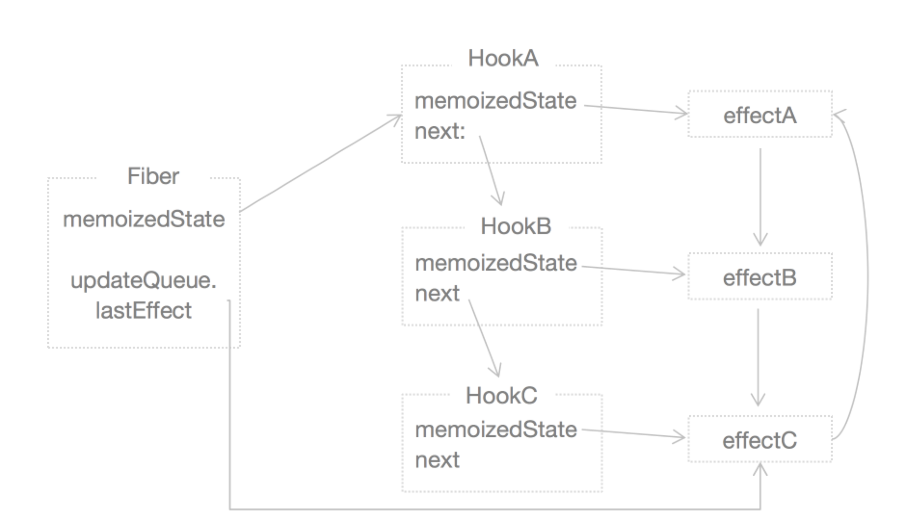

# ReactCurrentDispatcher详解
* 函数组件在实例化的时候可能会调用各种React`Hook`钩子（[参考文档](https://react.docschina.org/docs/hooks-intro.html)）
    - 除了函数组件执行的其他场景，`ReactCurrentDispatcher.current`都会设置成`ContextOnlyDispatcher`
    - 函数组件第一次实例化的时候`ReactCurrentDispatcher.current`都会设置成`HooksDispatcherOnMount`
    - 函数组件第一次以后其他实例化的时候`ReactCurrentDispatcher.current`都会设置成`HooksDispatcherOnUpdate`
    - 如果函数组件实例过程中存在调用`setState`类似的操作，`ReactCurrentDispatcher.current`都会设置成`HooksDispatcherOnRerender`

## ContextOnlyDispatcher
* 除了`readContext`，其他Hook在被调用的时候都会抛出错误
* ContextOnlyDispatcher 对象
```javascript
const ContextOnlyDispatcher: Dispatcher = {
  readContext,

  useCallback: throwInvalidHookError,
  useContext: throwInvalidHookError,
  useEffect: throwInvalidHookError,
  useImperativeHandle: throwInvalidHookError,
  useLayoutEffect: throwInvalidHookError,
  useMemo: throwInvalidHookError,
  useReducer: throwInvalidHookError,
  useRef: throwInvalidHookError,
  useState: throwInvalidHookError,
  useDebugValue: throwInvalidHookError,
  useResponder: throwInvalidHookError,
  useDeferredValue: throwInvalidHookError,
  useTransition: throwInvalidHookError,
  useMutableSource: throwInvalidHookError,
  useEvent: throwInvalidHookError,
};
```
### throwInvalidHookError
* 在被调用的时候会抛出： `hook` 只能在函数组件内被调用的错误信息
```javascript
function throwInvalidHookError() {
  invariant(
    false,
    'Invalid hook call. Hooks can only be called inside of the body of a function component. This could happen for' +
      ' one of the following reasons:\n' +
      '1. You might have mismatching versions of React and the renderer (such as React DOM)\n' +
      '2. You might be breaking the Rules of Hooks\n' +
      '3. You might have more than one copy of React in the same app\n' +
      'See https://fb.me/react-invalid-hook-call for tips about how to debug and fix this problem.',
  );
}
```

## HooksDispatcherOnMount
* HooksDispatcherOnMount 对象
```javascript
const HooksDispatcherOnMount: Dispatcher = {
  readContext,
  useCallback: mountCallback,
  useContext: readContext,
  useEffect: mountEffect, // useEffect和useState等的区别 useEffect将effect额外的添加到了fiber的UpdateQueue上 这么做的情况是希望effect会在组件更新的时候触发执行
  useImperativeHandle: mountImperativeHandle,
  useLayoutEffect: mountLayoutEffect,
  useMemo: mountMemo,
  useReducer: mountReducer,
  useRef: mountRef,
  useState: mountState,
  useDebugValue: mountDebugValue,
  useResponder: createDeprecatedResponderListener,
  useDeferredValue: mountDeferredValue,
  useTransition: mountTransition,
  useMutableSource: mountMutableSource,
  useEvent: mountEventListener,
};
```
### mountState
* 步骤：
    - 1新建一个hook，且将hook绑定为函数组件Fiber的`memoizedState`和`workInProgressHook`或者`workInProgressHook.next`，详细介绍请看下面关于`mountWorkInProgressHook`的介绍
    - 2生成一个默认state：如果`initialState`参数是一个函数，就执行后再次赋值给自己
    - 3将`initialState`赋值给上面第一步新建的`hook`的`memoizedState`属性和`baseState`属性
    - 4 生成一个用于修改`initialState`的派发器：`dispatch`，且将其赋值给`hook.queue`
* 源码
```javascript
function mountState<S>(
  initialState: (() => S) | S,
): [S, Dispatch<BasicStateAction<S>>] {
  const hook = mountWorkInProgressHook();
  if (typeof initialState === 'function') {
    // $FlowFixMe: Flow doesn't like mixed types
    initialState = initialState();
  }
  hook.memoizedState = hook.baseState = initialState;
  const queue = (hook.queue = {
    pending: null,
    dispatch: null,
    lastRenderedReducer: basicStateReducer,
    lastRenderedState: (initialState: any),
  });
  const dispatch: Dispatch<
    BasicStateAction<S>,
  > = (queue.dispatch = (dispatchAction.bind(
    null,
    currentlyRenderingFiber, // workInProgress，当前工作的Fiber
    queue, // 上面创建的对象
  ): any));
  return [hook.memoizedState, dispatch];
}
```

#### mountWorkInProgressHook
[参考文档](mountWorkInProgressHook解析.md)

#### basicStateReducer
```
// 基态Reducer
function basicStateReducer<S>(state: S, action: BasicStateAction<S>): S {
  //$FlowFixMe:流不喜欢混合类型
  // $FlowFixMe: Flow doesn't like mixed types
  return typeof action === 'function' ? action(state) : action;
}
```

#### dispatchAction
* [参考文档](dispatchAction解析.md)

### mountCallback
* 新建一个hook，且将hook绑定为函数组件Fiber的`memoizedState`和`workInProgressHook`或者`workInProgressHook.next`
* 将`workInProgressHook`重新设置为上面新建的`hook`，方便下次有hook钩子调用的时候接着为它的`next`属性赋值
* 给上面新建的`hook`的`memoizedState`属性赋值：`[callback, nextDeps]`
    > 以后当函数组件再次执行的时候，会对比`nextDeps`中每个变量的新旧值，如果新旧值相同，就去保存过得`hook`的`memoizedState`中的`callback`，否则将新传递进来的`callback`返回给组件实例用
    > 所以当函数组件用 `useCallback`的时候，你所传进去的`callback`并不是你会用到的回调函数，可能是之前的旧callback

```javascript
function mountCallback<T>(callback: T, deps: Array<mixed> | void | null): T {
  const hook = mountWorkInProgressHook();
  const nextDeps = deps === undefined ? null : deps;
  hook.memoizedState = [callback, nextDeps];
  return callback;
}
```

### mountEffect
* `mountEffect`函数主要调用了`mountEffectImpl`函数，接下来主要看`mountEffectImpl`函数
* `mountEffectImpl`函数的形参：
    - fiberEffectTag：UpdateEffect | PassiveEffect = 0b0000000000100 | 0b0001000000000 = 0b0001000000100 = 516
    - hookEffectTag：HookPassive = 0b100 = 4
    - create: `useEffect`第一个参数，一个函数，代表被动效果执行函数
    - deps：`useEffect`第二个参数，一个数组，代表该被动效果的依赖列表，deps里的任何一个变量变化时都会触发`create`参数的执行
* 执行步骤：
    - 新建一个hook，且将hook绑定为函数组件Fiber的`memoizedState`和`workInProgressHook`或者`workInProgressHook.next`
    - 设置`workInProgress`的`effectTag`属性，供React DevTools使用
    - 给上面新建的`hook`的`memoizedState`属性赋值
    
* 执行完后 Fiber对象`workInProgress`和当前组件的hooks以及当前组件的effects的关系如下图：

* 源码如下：
```javascript
function mountEffectImpl(fiberEffectTag, hookEffectTag, create, deps): void {
  const hook = mountWorkInProgressHook();
  const nextDeps = deps === undefined ? null : deps;
  currentlyRenderingFiber.effectTag |= fiberEffectTag;
  hook.memoizedState = pushEffect(
    HookHasEffect | hookEffectTag,
    create,
    undefined,
    nextDeps,
  );
}
```
#### pushEffect
* 步骤
    - 新建一个`effect`对象，用于存放被动效果的创建函数`create`、依赖`deps`、销毁函数`destroy`、当前被动效果的下一个被动效果`effect`，以及描述此被动效果的标签`tag`。`tag = HookHasEffect | hookEffectTag = 0b001 | HookPassive =0b001 | 0b100 = 5`
    - 先判断 `workInProgress.UpdateQueue`有没有值，没有值新建一个 `{ lastEffect: null, }`对象赋值给 `workInProgress.UpdateQueue`，有值的话updateQueue.lastEffect指向了最后的最新的也就是当前创建的`effect`，而当前创建的`effect.next`指向第一个effect，从而形成一个闭环

* 源码
```javascript
function pushEffect(tag, create, destroy, deps) {
  const effect: Effect = {
    tag,
    create,
    destroy,
    deps,
    // Circular
    next: (null: any),
  };
  let componentUpdateQueue: null | FunctionComponentUpdateQueue = (currentlyRenderingFiber.updateQueue: any);  
  // 如果workInProgress的UpdateQueue是空的，则创建一个对象赋值给workInProgress.UpdateQueue： { lastEffect: null, }
  if (componentUpdateQueue === null) {
    componentUpdateQueue = createFunctionComponentUpdateQueue();
    currentlyRenderingFiber.updateQueue = (componentUpdateQueue: any);
    // 为workInProgress.updateQueue的lastEffect的增加effect闭环，即workInProgress.UpdateQueue.lastEffect= effect，而effect.next = effect
    componentUpdateQueue.lastEffect = effect.next = effect;
  } else {
    const lastEffect = componentUpdateQueue.lastEffect;
    if (lastEffect === null) {
      componentUpdateQueue.lastEffect = effect.next = effect;
    } else {
      const firstEffect = lastEffect.next;
      lastEffect.next = effect;
      effect.next = firstEffect;
      componentUpdateQueue.lastEffect = effect;
    }
  }
  return effect;
}
```

### mountLayoutEffect
* `mountLayoutEffect` 与 `mountEffect`的方式一样，都调用了`mountEffectImpl` 只是`mountEffectImpl`的参数传值发生了变化：
    - fiberEffectTag：UpdateEffect  = 0b0000000000100  = 4
    - hookEffectTag：HookLayout = 0b010 = 2

### mountImperativeHandle
* `mountImperativeHandle` 与 `mountEffect`的方式一样，都调用了`mountEffectImpl` 只是`mountEffectImpl`的参数传值发生了变化：
    - fiberEffectTag：UpdateEffect  = 0b0000000000100  = 4
    - hookEffectTag：HookLayout = 0b010 = 2
    - create: 返回`imperativeHandleEffect`函数，该函数内执行了`mountImperativeHandle`第二个参数，且将执行后结果赋值给`ref.current`,且return出一个将`ref`设置为`null`的回调函数
    - effectDeps: `[ref, ...deps]`，将`ref`加入到依赖中
    
* 源码
```javascript
function mountImperativeHandle<T>(
  ref: {|current: T | null|} | ((inst: T | null) => mixed) | null | void,
  create: () => T,
  deps: Array<mixed> | void | null,
): void {
  // 将ref添加到该被动效果的依赖列表中
  const effectDeps =
    deps !== null && deps !== undefined ? deps.concat([ref]) : null;

  return mountEffectImpl(
    UpdateEffect,
    HookLayout,
    imperativeHandleEffect.bind(null, create, ref),
    effectDeps,
  );
}
```
#### imperativeHandleEffect
* 通过 `imperativeHandleEffect` 的第二个参数创建出需要为父组件提供的对象，然后赋值给`ref.current`，这样父组件就可以通过`.current`，调用子组件想要让父组件调用的函数或者参数
* 最后返回`imperativeHandleEffect`的销毁函数
* 源码
```javascript
function imperativeHandleEffect<T>(
  create: () => T,
  ref: {|current: T | null|} | ((inst: T | null) => mixed) | null | void,
) {
  if (typeof ref === 'function') {
    const refCallback = ref;
    const inst = create();
    refCallback(inst);
    return () => {
      refCallback(null);
    };
  } else if (ref !== null && ref !== undefined) {
    const refObject = ref;
    const inst = create();
    refObject.current = inst;
    // 这是销毁函数
    return () => {
      refObject.current = null;
    };
  }
}
```


## HooksDispatcherOnUpdate
```javascript
const HooksDispatcherOnUpdate: Dispatcher = {
  readContext,

  useCallback: updateCallback,
  useContext: readContext,
  useEffect: updateEffect,
  useImperativeHandle: updateImperativeHandle,
  useLayoutEffect: updateLayoutEffect,
  useMemo: updateMemo,
  useReducer: updateReducer,
  useRef: updateRef,
  useState: updateState,
  useDebugValue: updateDebugValue,
  useResponder: createDeprecatedResponderListener,
  useDeferredValue: updateDeferredValue,
  useTransition: updateTransition,
  useMutableSource: updateMutableSource,
  useEvent: updateEventListener,
};
```

## HooksDispatcherOnRerender
```javascript
const HooksDispatcherOnRerender: Dispatcher = {
  readContext,

  useCallback: updateCallback,
  useContext: readContext,
  useEffect: updateEffect,
  useImperativeHandle: updateImperativeHandle,
  useLayoutEffect: updateLayoutEffect,
  useMemo: updateMemo,
  useReducer: rerenderReducer,
  useRef: updateRef,
  useState: rerenderState,
  useDebugValue: updateDebugValue,
  useResponder: createDeprecatedResponderListener,
  useDeferredValue: rerenderDeferredValue,
  useTransition: rerenderTransition,
  useMutableSource: updateMutableSource,
  useEvent: updateEventListener,
};
```
