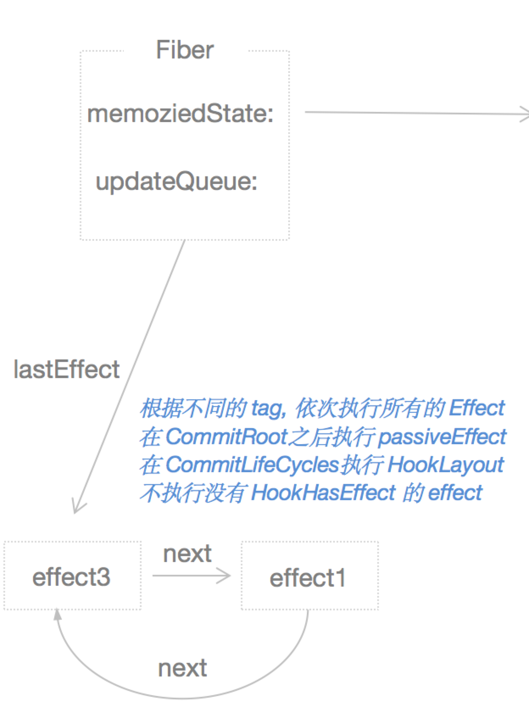

# pushEffect 解析
* `pushEffect`函数的目的就是创建一个被动效果的对象`effect`，然后将当前函数组件对应的`Fiber`对象的`UpdateQueue`的`lastEffect`属性指向该`effect`，然后将该`effect`的next属性指向`Fiber`对象的`UpdateQueue`的`lastEffect`之前原本的一系列`effect`链条，形成一个回环
* 步骤
    - 新建一个`effect`对象，用于存放被动效果的创建函数`create`、依赖`deps`、销毁函数`destroy`、当前被动效果的下一个被动效果`effect`，以及描述此被动效果的标签`tag`。`tag = HookHasEffect | hookEffectTag = 0b001 | HookPassive =0b001 | 0b100 = 5`
    - 先判断 `workInProgress.UpdateQueue`有没有值，没有值新建一个 `{ lastEffect: null, }`对象赋值给 `workInProgress.UpdateQueue`，有值的话updateQueue.lastEffect指向了最后的最新的也就是当前创建的`effect`，而当前创建的`effect.next`指向第一个effect，从而形成一个闭环


## 源码
```javascript
function pushEffect(tag, create, destroy, deps) {
  const effect: Effect = {
    tag,
    create, // useEffect函数的第一个参数
    destroy, // useEffect第一个参数执行后返回的回调函数
    deps, // useEffect的第二个参数， 依赖项
    // Circular
    next: (null: any),
  };
  let componentUpdateQueue: null | FunctionComponentUpdateQueue = (currentlyRenderingFiber.updateQueue: any);
  // 为fiber.updateQueue增加effect
  if (componentUpdateQueue === null) {
    componentUpdateQueue = createFunctionComponentUpdateQueue();
    currentlyRenderingFiber.updateQueue = (componentUpdateQueue: any);
    componentUpdateQueue.lastEffect = effect.next = effect;
  } else {
    const lastEffect = componentUpdateQueue.lastEffect;
    if (lastEffect === null) {
      componentUpdateQueue.lastEffect = effect.next = effect;
    } else {
      const firstEffect = lastEffect.next;
      lastEffect.next = effect;
      effect.next = firstEffect;
      componentUpdateQueue.lastEffect = effect;
    }
  }
  return effect;
}
```
