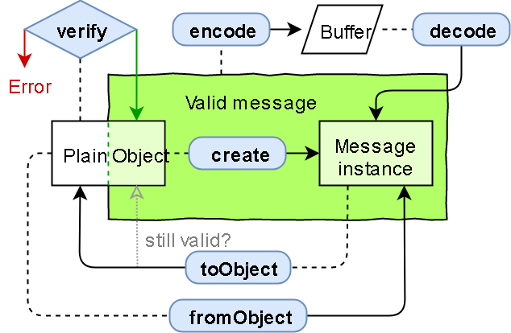

# protobuf.js
protobuf.js是一个纯JavaScript实现，支持Node.js和浏览器的TypeScript，它容易使用速度快速，可以直接反射.proto文件，不需要生成任何文件
protobuf.js是基于ByteBuffer.js的Protocol Buffers纯JavaScript实现，主要功能是解析.proto文件，构建Message类，编码解码

## Protocol Buffers
Protocol Buffers是Google公司开发的一种数据描述语言，类似于XML能够将结构化数据序列化，可用于数据存储、通信协议等方面。它不依赖于语言和平台并且可扩展性极强。现阶段官方支持C++、JAVA、Python等三种编程语言，但可以找到大量的几乎涵盖所有语言的第三方拓展包。
[参考文档](Protocol-Buffers.md)


## pbjs 工具
* 将`.proto`文件转换为`json`文件
```
 pbjs -t json agentstatus.proto > agentstatus.json
```
* 将`.proto`文件转换为`js`文件
```
pbjs -t static-module -w commonjs -o agentstatus.js agentstatus.proto
```

* 编写pbjs命令的转换脚本
```
$ vim pbjs.cmd
```
  
```
::判断当前目录是否存在node.exe
@IF EXIST "%~dp0\node.exe" (
    ::使用node执行pbjs进行文件转换
    "%~dp0\node.exe" "%~dp0\..\protobufjs\bin\pbjs" %*
) ELSE (
    @SETLOCAL
    ::将环境变量PATHEXT中的JS删除
    @SET PATHEXT=%PATHEXT:;.JS;=;%
    ::使用node执行pbjs进行文件转换
    node "%~dp0\.. \protobufjs\bin\pbjs" %*
)
```

## protobuf.js使用
### 有效消息


| 方法| 描述|
| --- | --- |
| Message.verify(message:Object):null|string	| 验证普通JavaScript对象是否满足有效消息的要求，以确保无错误的进行加密编码（encode）。verify不抛出错误而会将错误消息作为字符串返回。
| Message.encode(message:Message|Object [, writer:Writer]):Writer	| 对消息实例或有效的纯JavaScript对象进行编码，encode不隐式的验证消息，而由用户确定有效负载是有效消息。
| Message.encodeDelimited(message:Message|Objecct [, writer:Writer]):Writer	| 将protobuffer解码为消息实例，如果required字段缺少则会抛出util.ProtocolError错误。
| Message.decodeDelimited(reader:Reader|Uint8Array):Message	| 工作方式类似于decode函数，会另外读取一个消息的长度作为变量的预设值。
| Message.create(properties:Object):Message	| 从一组满足有效消息要求的属性中创建一个新消息实例，如果适用，建议首选create而非fromObject，因为create不会执行可能存在冗余的转换。
| Message.fromObject(object:Object):Message	| 将任何无效的纯JavaScript对象转换为消息实例
| Message.toObject(message:Message [, options:ConversionOptions]):Object	| 将消息实例转换为任意纯JavaScript对象，以便与其它库或存储进行互操作。根据指定的实际转换选项，生成纯JavaScript对象。

### protobuf.js 使用
* 引入protobuf.js
```javascript
import protobufjs from 'protobufjs'
```
* 引入`.proto`文件
    - 新建.proto文件
    ```
    syntax = "proto3";
    package protocol.protobuf;
    
    option java_package = "xxx.protobuf";
    option java_outer_classname = "C2Ai";
    
    message C2AiRequest {//用户发给机器人的消息
      string from = 1;//发送者ID
      string fromName = 2;
      int32 fromDomain = 3;//发送者所属用户类型,具体见DomainType
      string guid=4;//用户guid
      int64 chatId = 5;//会话ID
      string sceneId=6;//场景ID
      string content = 7;//消息内容
      int32 type = 8;//消息类型，比如文本，图片，文件等
      string appId = 9;//app标识
      string ext = 10;//扩展内容，建议采用富文本
    }
    
    message C2AiResponse {
        int64 msgid = 1;//落地存储的消息id（针对此条消息）
        int64 timestamp = 2;//收到群聊消息的时间戳
    }
    
    
    ```
    - 在js中引入.proto文件
        > 原理是：webpack中配置loader，将.proto文件当做string引入
        ```
        {
            test: /\.proto$/,
            loader: 'raw-loader',
        }
        ```
    ```javascript
    import c2ai from '../proto/c2ai.proto'
    ```
* protobufjs.parse
分析给定的.proto源并返回包含已分析内容的对象object。

```javascript
const parser = protobufjs.parse(c2ai)
```
* protobufjs.lookup
> 通过lookup得到的是一个message有效消息对象，里面有`create`、`encode`、`decode`、'fromObject`、`toObject`等protobufjs消息对象所有的方法
```javascript
const Request = root.lookup('C2AiRequest')
const Response = root.lookup('C2AiResponse')
```

**本文档内容摘自此博客[https://www.jianshu.com/p/da48fb06b29f],推荐大家阅读源博客，更深入**
