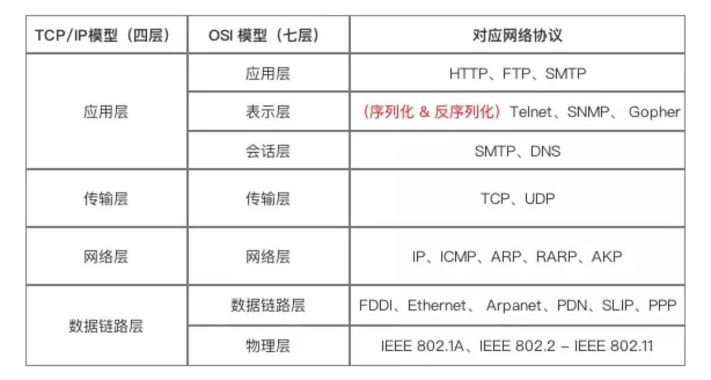
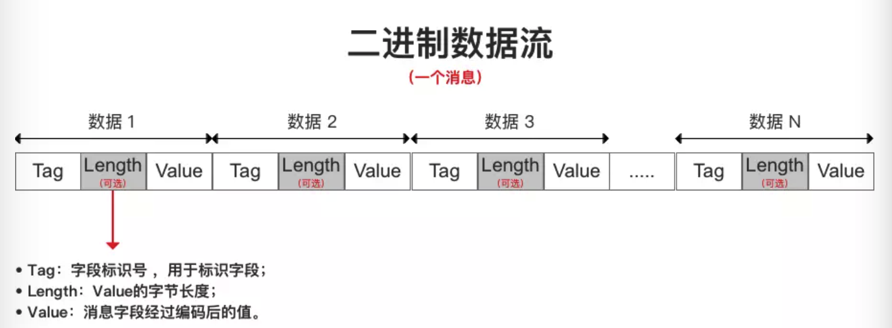
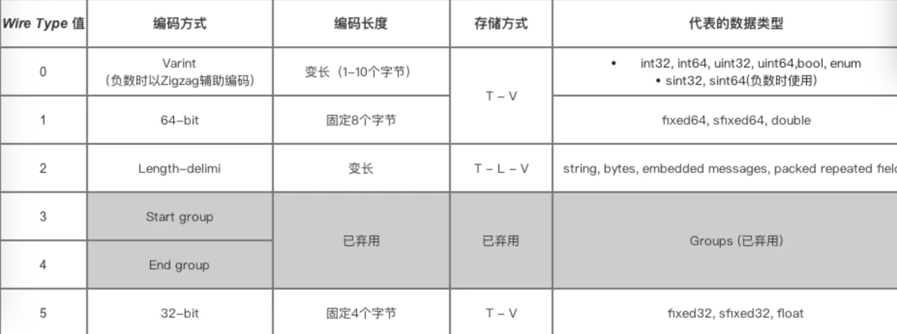
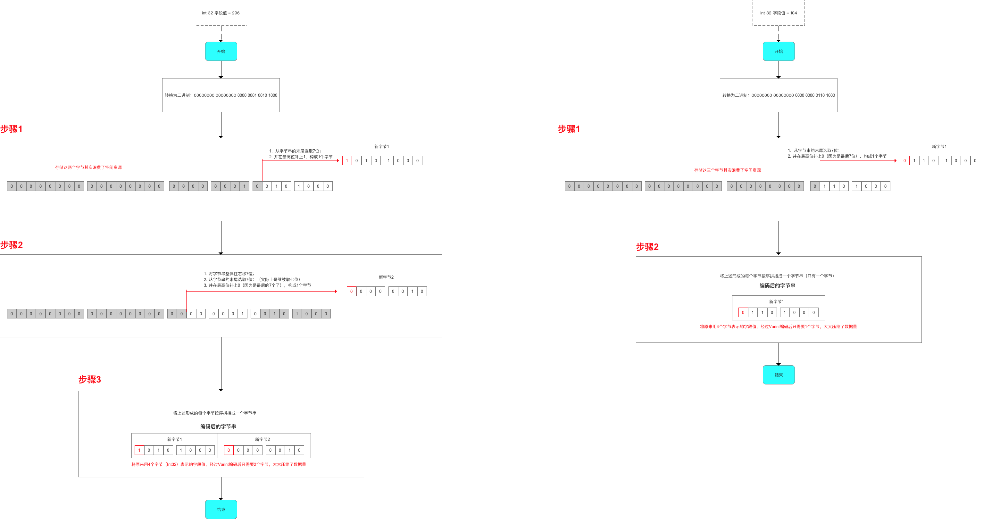

# Protocol Buffers

## 定义
Protocol Buffers是一种以有效并可扩展的格式编码结构化数据的方式。一种 结构化数据 的数据存储格式（类似于 XML、Json ）
* Google 出品 （开源）
* Protocol Buffer 目前有两个版本：proto2 和 proto3

## 作用
通过将 结构化的数据 进行 串行化（序列化），从而实现 数据存储 / RPC 数据交换的功能
* 序列化： 将 数据结构或对象 转换成 二进制串 的过程
* 反序列化：将在序列化过程中所生成的二进制串 转换成 数据结构或者对象 的过程

## 特点

### 优点
* 性能
    - 体积小，序列化后数据大小可缩小3倍
    - 序列化速度快 比XML和Json快20-100倍
    - 传输速度快 因为体积小，所以传输起来带宽和速度会有优化
* 使用
    - 使用简单 proto编译器自动进行序列化和反序列化
    - 维护成本低 多平台仅需要维护一套对象协议文件(.proto)
    - 向后兼容兼好 扩展性好，不必破坏旧数据格式就可以对数据结构进行更新
    - 加密性好 http抓包只能看到字节
* 使用范围
    - 跨平台
    - 跨语言
    - 可扩展性好
### 缺点
* 功能方面
    - 不适合基于文本的标记文档（html）建模，因为文本不适合描述数据结构
* 其他方面
    - 通用性差
    - 自解释性差 以二进制数据流方式存储（不可读），需要通过`.proto`文件才能了解到数据结构

## 应用场景
* 传输数据量大 & 网络环境不稳定 的数据存储、RPC 数据交换 的需求场景
  如 即时IM （QQ、微信）的需求场景
  
## 知识基础
### 网络通信协议
* 序列化和反序列化 属于通讯协议的一部分（Protocol Buffer属于 TCP/IP模型的应用层 & OSI模型的展示层）
    - 序列化：把应用层的对象转化成二进制串
    - 反序列化：把二进制串转换成应用层的对象
* 通讯协议采用分层模型：TCP/IP模型（4层）和OSI模型（七层）

### 数据结构、对象与二进制串
不同的计算机语言中，数据结构，对象以及二进制串的表示方式并不相同。
### T - L - V 的数据存储方式
* 即 Tag - Length - Value，标识 - 长度 - 字段值 存储方式
    - 以 标识 - 长度 - 字段值 表示单个数据，最终将所有数据拼接成一个 字节流，从而 实现 数据存储 的功能

* 优点
    - 不需要分隔符 就能 分隔开字段，减少了 分隔符 的使用
    - 各字段 存储得非常紧凑，存储空间利用率非常高
    - 若 字段没有被设置字段值，那么该字段在序列化时的数据中是完全不存在的，即不需要编码
###  序列化原理解析
* Protocol Buffer将 消息里的每个字段 进行编码后，再利用T - L - V 存储方式 进行数据的存储，最终得到的是一个 二进制字节流
* Protocol Buffer对于不同数据类型 采用不同的 序列化方式（编码方式 & 数据存储方式）

    - 对于存储Varint编码数据，就不需要存储字节长度 Length，所以实际上Protocol Buffer的存储方式是 T - V
    - 若Protocol Buffer采用其他编码方式（如LENGTH_DELIMITED）则采用T - L - V
* 因为 Protocol Buffer对于数据字段值的 独特编码方式 & T - L - V数据存储方式，使得 Protocol Buffer序列化后数据量体积如此小

#### 编码方式
Protocol Buffer 通过Varint和Zigzag编码后大大减少了字段值占用字节数。

* Varint
    - 定义：一种变长的编码方式
    - 原理：用字节 表示 数字：值越小的数字，使用越少的字节数表示
    - 作用：通过减少 表示数字 的字节数 从而进行数据压缩
    > 对于 int32 类型的数字，一般需要 4个字节 表示；一个字节（BYTE)由8位（BIT)二进制位组成,
      若采用 Varint编码，对于很小的 int32 类型 数字，则可以用 1个字节 来表示
      虽然大的数字会需要 5 个 字节 来表示，但大多数情况下，消息都不会有很大的数字，所以采用 Varint方法总是可以用更少的字节数来表示数字

    - Varint 编码方式的不足
        + 在计算机内，因为计算机定义负数的符号位为数字的最高位, 负数一般会被表示为很大的整数
        > 如果采用 Varint编码方式 表示一个负数，那么一定需要 5 个 byte（因为负数的最高位是1，会被当做很大的整数去处理）
        + 解决方案: Protocol Buffer 定义了 sint32 / sint64 类型表示负数，通过先采用 Zigzag 编码（将 有符号数 转换成 无符号数），再采用 Varint编码，从而用于减少编码后的字节数
       
* Zigzag(特别是对 表示负数的数据 能更好地进行数据压缩)
    - 定义：一种变长的编码方式
    - 原理：使用 无符号数 来表示 有符号数字；
    
    - 作用：使得绝对值小的数字都可以采用较少 字节 来表示；
    > Zigzag 编码 是补充 Varint编码在 表示负数 的不足，从而更好的帮助 Protocol Buffer进行数据的压缩
    所以，如果提前预知字段值是可能取负数的时候，记得采用sint32 / sint64 数据类型

