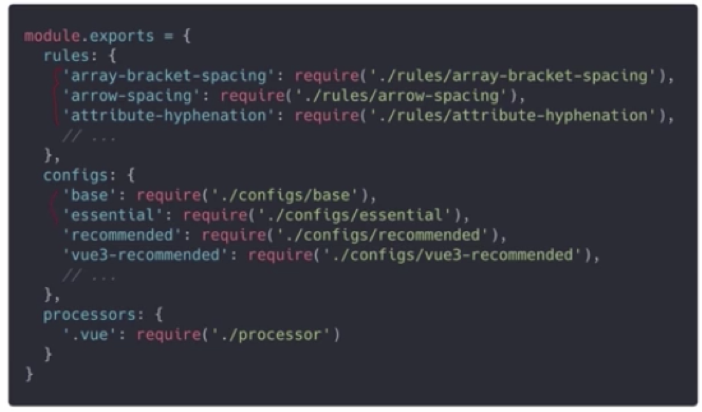

# 代码规范
## 为什么要建立团队代码规范
* 增强团队协作效率
    - 每个工程师都有自己的主观编程风格，但作为一个团队，必须在可读上找到最大公约数
* 提高代码质量
    - 优秀的编程习惯，应该沉淀下来成为一个团队的军规而不是工程师个人的选择
* 减缓系统腐化的速度
## 建立代码规范的原则
* 代码规范是一个找公约数的过程
    - 需要听取团队每个成员的意见，除了会引起质量问题的编码习惯，其他意见都值得被尊重
* 本着可读性第一的目标
    - 代码规范是为了帮助人与人之间的协作，可读性应该是第一目标
* 循序渐进的建立规范
    - 代码规范不应该成为工程师工作之外的负担，建立规范的过程可以求同存异，小步快跑

## 社区已有的规范
* HTML/CSS 规范
    - Google HTML/CSS/JS规范
    - Airbnb Style规范（包括CSS和Sass）
一般来说，由于MV*框架的出现，纯HTML/CSS的规范在现在只能当做一份最佳实践，但不必严格遵守
* JavaScript规范
    - Airbnb JavaScript规范
    - JavaScript Standard Style规范 生态丰富，提供了开箱即用的各种lint规则和编辑器插件
* 框架相关
    - Vue Style Guide规范 VueJs官方推荐的编码规范
    - Airbnb React/JSX Style Guide

## 建立代码规范-ESLint
* ESLint介绍： 一款高度可配置的JavaScript静态代码检查工具，已成为JS代码检查的事实标准
* 特点
    - 完全的可拔插，一切行为都可以通过配置产生
    - 任意rule之间都是独立的
    
* 原理
    - 先通过解析器（parser）将JavaScript代码解析为抽象语法树（AST），再调用规则（rule）对AST进行检查，从而实现对代码的检查
* AST浅析
    - AST是一种可比案例的、描述代码的树状结构，利用AST可以方便的分析代码的结构和内容 [AST Explore](https://astexplorer.net/)

* ESLint CLI
```
eslint -h
```

* CLI之外
    - 编辑器集成 VS Code、Atom、Vim、SublimeText... 在写代码的时候就可以实时检查代码
    - 构建工具集成：Webpack、Rollup、Gulp、Grunt... 在构建过程中进行代码检查
* ESLint
    - 配置文件的格式：JavaScript/JSON或者YAML, 也可以在package.json的eslintConfig字段配置
    - ESLint配置的主要内容：
        + Parser：ESLint使用哪种解析器
        ```
        {
            // 指定Eslint使用哪种解析器： Espree默认、Esprima、Babel-ESLint
            "parser": "esprima",
            // 配置parser的参数，parser会接受这些参数，并影响其解析代码的行为
            "parserOptions": {
                "ecmaVersion": 6,
                "sourceType": "module",
                "ecmaFeatures": {
                    "jsx": true
                }
            }
        }
        ```
        + Environments：选择你的代码泡在什么环境中（browser、node、commonjs、es6、es2017、worker）
        + Globals： 除了Env外，其他需要额外指定的全局变量
        ```
        {
            // 配置环境
            "env": {
                "browser": true,
                "node": true
            },
            // 是env之外需要额外指定的全局变量。有三种配置：writeable-可写、readonly-只读、off-不支持
            "globals": {
                "var1": "writable",
                "var2": "readonly",
                "var3": "off"
            }
        }
        ```
        + Rules： 规则，无默认开启规则，但提供了推荐开启的规则：`"extends": "eslint:recommended"`
            [ESLint Rules List](https://eslint.bootcss.com/docs/rules/)
        ```
        // 错误级别
        // 1. off 或者 0 关闭规则
        // 2. warn 或者 1 将规则视为一个警告
        // 3. error 或 2 讲规则视为一个错误
        // 配置形式
        // 1 值： 数字或者字符串，表示错误级别
        // 2 数组： 第一项错误级别，之后的各项是对该规则的额外的配置
        {
            "rules": {
                // 允许非全等号
                "eqeqeq": "off",
                // 尽可能使用花括号
                "curly": "error",
                // 双引号
                "queotes":["error", "double"],
             
                "no-console":["warn", [ "allow": ["warn", "error"]]],
                // 必须写分号，除了LastInOneLineBlock
                "semi":[2, "always", { "omitLastInOneLineBlock": true }
                // plugin中的规则，不是内置规则
                "plugin1/rule1": "error"
            }
        }
        ```
          
        + Plugins： 一组以上的配置项以及processor的集合，往往用于特定类型文件的代码检查，如.md文件。ESLint插件是对一系列rules、environments、globals、processors等配置的封装
        
        + Extends：你想继承的配置
        
### ESlint 插件

* 可以单独引用规则
* 可以直接使用（继承）eslint-plugin-vue配置好的config
* 预处理器的作用： 解析.vue文件

### Extends
extends是一种非常灵活的ESLint配置机制，使用Extends，可以一次递归的应用每一个eslint配置文件，实现灵活的组合
* 可以用extends来全家桶式的使用第三方配置好的规则
* 可以嵌套
* 使用extends之后，我们的rules可以：覆盖重写第三方规则、只改变第三方规则的错误登记、添加新的规则

## 编写自己的ESLint规则
* 规则： no-caller，禁止arguments.caller和arguments.callee的使用
* meta部分主要包括规则的描述、类别、文档地址、修复方式以及配置下schema等信息
* create则需要定义一个函数用于返回一个包含了遍历规则的对象，并且该函数会接收context对象作为参数
    ```javascript
    module.exports = {
        meta: {
            type: 'suggestion',
            docs: {
                description: 'disallow the use of `arguments.caller` or `arguments.callee`',
                category: 'Best Practices',
                recommended: false,
                url: 'https://eslint.org/docs/rules/no-caller'
            },
            schema: [],
            messages: {
                unexpected: 'Avoid arguments.{{prop}}.'
            }
        },
        create() {
            return {
                MemberExpression(node) {
                    const objectName = node.object.name
                    const propertyName = node.property.name
                    if (
                        objectName === 'arguments' &&
                        !node.computed &&
                        propertyName &&
                        propertyName.match(/^calle[er]$/u)
                    ) {
                        context.report({
                            node,
                            messageId: 'unexpected',
                            data: { prop: propertyName }
                        })
                    }
                }
            }
        },
    }
    ```
    [ESTree开发参考文档](https://github.com/estree/estree)
    [ESLint Rules 开发文档](https://eslint.bootcss.com/docs/developer-guide/working-with-plugins)

### 例子
* 命题：检查class是否有constructor构造方法
```javascript
module.exports = {
    meta: {
        docs: {
            description: 'require class constructor',
            category: 'Best Practices',
            recommended: true,
        },
        fixable: true,
        schema: []
    },
    create: function(context) {
        return {
            ClassDeclaration(node) {
                const body = node.body.body
                const result = body.some(
                    element => element.type === 'MethodDefinition' && element.kind === 'constructor'
                )
                if (!result) {
                    context.report({
                        node,
                        message: 'no constructor found',
                    })
                }
            }
        }
    }
}
```
* 修改package.json中的scripts字段
```
{
    scripts: {
        ...
        lint2: eslint . --rulesdir ./rules/     # 自定义eslint规则文件所在目录
        ...
    }
}
```

#### 规则编写套路
* meta部分
* create部分- 在什么时机检查？ -ClassDeclaration
* create部分 - 怎么检查？ -遍历AST
* AST查看 [AST Exploer](https://astexplorer.net/)

### Stylelint 介绍
* 社区活跃，生态丰富
* 插件化，功能强大
* 不仅支持CSS, 还支持SCSS/SASS/less等预处理器
* 已经在facebook github wordPress 等大厂得到广泛应用
### Prettier
* Prettier是一个流行的代码格式化工具
* 为什么需要Prettier？
    - Prettier称自己最大的作用是可以让大家停止对代码格式无意义的辩论
    - Prettier在一众工具化中非常特殊，严格控制配置项的数量，它对默认格式的选择，完全遵循【让可读性更高】这一标准
* Prettier vs Linters
    - Prettier认为，Lint分为两类：
        + 格式优化类： max-len、no-mixed-spaces-and-tabs、keyword-spacing、comma-style...
        + 代码质量类：no-unused-vars、no-extra-bind、no-implicit-globals、prefer-promise-reject-errors...
    - Prettier只关注第一类，且不会以报错的形式告知格式问题，而是允许开发者按照自己的方式编写代码，但会在特定的时机（save、commit）将代码格式化为可读性最好的形式
* Prettier配置
```
{
    "parser": "babylon", // 使用的parser
    "printWidth": 80, // 换行字符串阈值
    "tabWidth": 2, // 缩进空格数
    "useTabs": false, // 使用空格缩进
    "semi": true, // 句末加分号
    "singleQuote": false, // 用双引号
    "bracketSpacing": true, // 对象数组加空格
    "jsxBracketSameLine": false, // jsx > 是否另起一行
    "arrowParents": "avoid", // (x) => {} 是否要有小括号
    "requirePragma": false, // 是否要注释来决定是否格式化代码
    "insertPragma": false, // 是否为已经格式化的代码加注释标记
    "proseWrap": "preserve" // 是否要换行
}
```

### Prettier的使用
有很多方法去触发Prettier的格式化行为：CLI、Watch Changes、git hooks、与Linter集成

* Watch Changes
    ```
    // package.json
    {
        ...
        "scripts": {
            "prettier-watch": "onchange '**/*.js' -- prettier --write {{changed}}"
        }
        ...
    }
    ```
* 与ESLint的集成
```
yarn add --dev eslint-config-prettier eslint-plugin-prettier
```
```
// .eslintrc.json
{
    "extends": ["prettier"],
    "plugins": [prettier],
    "rules": {
        "prettier/prettier": "error"
    }
}
```
