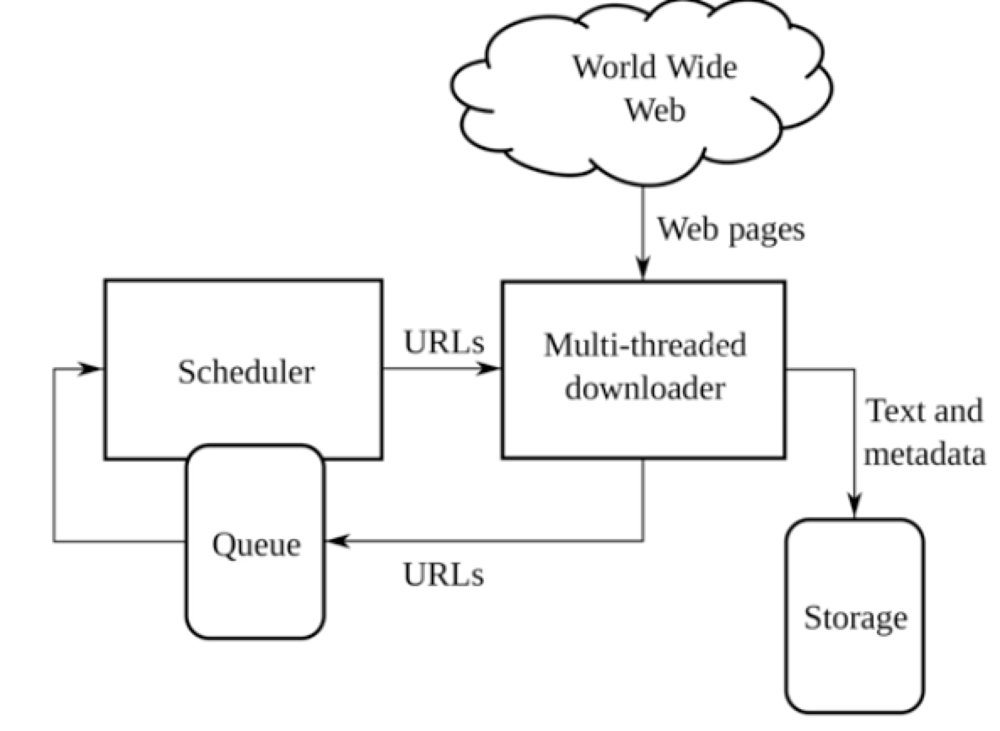

# JS实战爬虫
> 可以利用爬虫分析自己的市场，分析竞争对手的数据，但我们深刻谴责任何利用爬虫做一切不道德不合法的行为


## 爬虫
* 现存功能
    + 当初创公司刚开始没有名气无法获得市场相关数据的时候可以用爬虫获取（可能违法，破坏互联网规则）如： 携Ch->航K公司
    + 水军   网页评论、人气等功能
* Scheduler 调度
爬虫要爬取的网址不一定只有一个，可能是多个，或者说爬取一个网站中一类数据的请求也不止一个，那么就需要调度功能平衡资源：比如有很多机器，有很多CPU内核，网络没用满就可以用调度器平衡，可以同时开10个爬虫等等

调度器也负责爬完某个网页接下来爬取什么

调度器会找到很多的`URL`交给下载器`Multi-threaded downloader`

* Multi-threaded downloader 下载器

下载器与万维网`Word Wide Web`相关联，一个不好的下载器如果在遇到一个网页是通过js渲染的情况下（vue或react客户端渲染）可能获取到的是一个空的HTML页面。一个好的下载器内部应该是一个浏览器的内核帮我们做很多事情

下载器下载的数据需要存储到 `Storage` 中

下载器下载的数据需要分析，产生新的 `URLS`，然后再交给 `Scheduler`调度去爬取相关内容

* Storage 存储器

## 爬虫爬取方法

* 直接通过分析网页`network`相关接口请求爬取相关请求的数据
```javascript
const fetch = require('node-fetch')

fetch('https://api.bilibili.com/x/web-show/res/frontpage?resid=142')
.then(resp => {
    return resp.json()
})
.then(data => {
    console.log(data)
})
```
> 存在一定的问题：比如该网站需要登录，当我们通过爬虫爬账号登录的情况下一些接口的时候会失效，我们还得再分析cookie token之类的信息

* 按照用户人的逻辑，先看到页面，然后模拟用户的动作比如滑动页面点击按钮这类动作爬取数据
> 这种方式需要一个浏览器的内核（[Puppeteer](https://github.com/puppeteer/puppeteer)）
> puppeteer 最大的作用不是做爬虫，而是前端做自动化测试用的：如利用puppeteer在某段时间对我们的项目的一张网页截图，再利用puppeteer访问这个网页，再截图对比，如果网页有变化但图片没更新证明缺少测试用例，那么我们可以提醒相关人员进行补充测试用例。或者线上有bug 白屏有一部分内容未显示，我们也可以及时知道然后解决问题

## 利用 Puppeteer 实现一个爬虫

* 安装 `Puppeteer`
```
npm install puppeteer
```

* 编写简单 爬虫
```javascript
const puppeteer = require('puppeteer')

async function start() {
    // 启动一个浏览器
    const browser = await puppeteer.launch()
    // 打开一个页面 相当于新开了一个Tab页
    const page = await browser.newPage()
    // 为该Tab设置一个url
    await page.goto('https://www.bilibili.com')

    // evaluate 的回调函数是执行在浏览器端的
    const cards = await page.evaluate(() => {
        // 浏览器端执行 window这类的浏览器端对象是可以访问的
        // 找到dom元素，并不适合返回让node程序接收，因为数据复杂。 可以返回相对简单的数据结构
        const cards = document.querySelectorAll('.video-card-reco')

        // 获取元素内部文案
        function getText(node, cls) {
            if(node.querySelector(cls)) {
                return node.querySelector(cls).innerText
            }
            return null
        }

        // cards 是一个迭代器 类数组并不是数组，利用 ... 转换为数组
        return [...cards].map(card => {
            let title =  getText(card, '.title')
            let up = getText(card, '.up')
            return {
                title,
                up,
            }
        })
    })

    console.log(cards)
}

start()
```

* 为爬虫加入滚动页面功能

```javascript
const puppeteer = require('puppeteer')

async function start() {
    // 启动一个浏览器
    const browser = await puppeteer.launch()
    // 打开一个页面 相当于新开了一个Tab页
    const page = await browser.newPage()
    // 为该Tab设置一个url
    await page.goto('https://www.bilibili.com')

    // evaluate 的回调函数是执行在浏览器端的
    const cards = await page.evaluate(() => {
        // 浏览器端执行 window这类的浏览器端对象是可以访问的

        // 翻页函数
        function next(n, callback) {
            if (n > 0) {
                // 每次滚动一个屏幕
                window.scrollBy(0, window.innerHeight)
            } else {
                return callback()
            }

            setTimeout(() => {
                next(n-1, callback)
            }, 1000)
        }
        
        return new Promise((resolve, reject) => {
            next(10, () => {
                // 找到dom元素，并不适合返回让node程序接收，因为数据复杂。 可以返回相对简单的数据结构
                const cards = document.querySelectorAll('.video-card-reco')

                // 获取元素内部文案
                function getText(node, cls) {
                    if(node.querySelector(cls)) {
                        return node.querySelector(cls).innerText
                    }
                    return null
                }

                // cards 是一个迭代器 类数组并不是数组，利用 ... 转换为数组
                resolve([...cards].map(card => {
                    let title =  getText(card, '.title')
                    let up = getText(card, '.up')
                    return {
                        title,
                        up,
                    }
                }))
            })
        })
    })

    console.log(cards)
}

start()

```
* 可以提取 `evaluate`的浏览器执行函数为单独的函数或者文件
```javascript
const puppeteer = require('puppeteer')

// evaluate浏览器执行函数
function findCards() {
    // 浏览器端执行 window这类的浏览器端对象是可以访问的

    // 翻页函数
    function next(n, callback) {
        if (n > 0) {
            // 每次滚动一个屏幕
            window.scrollBy(0, window.innerHeight)
        } else {
            return callback()
        }

        setTimeout(() => {
            next(n-1, callback)
        }, 1000)
    }

    return new Promise((resolve, reject) => {
        next(10, () => {
            // 找到dom元素，并不适合返回让node程序接收，因为数据复杂。 可以返回相对简单的数据结构
            const cards = document.querySelectorAll('.video-card-reco')

            // 获取元素内部文案
            function getText(node, cls) {
                if(node.querySelector(cls)) {
                    return node.querySelector(cls).innerText
                }
                return null
            }

            // cards 是一个迭代器 类数组并不是数组，利用 ... 转换为数组
            resolve([...cards].map(card => {
                let title =  getText(card, '.title')
                let up = getText(card, '.up')
                return {
                    title,
                    up,
                }
            }))
        })
    })
}

async function start() {
    // 启动一个浏览器
    const browser = await puppeteer.launch()
    // 打开一个页面 相当于新开了一个Tab页
    const page = await browser.newPage()
    // 为该Tab设置一个url
    await page.goto('https://www.bilibili.com')

    // evaluate 的回调函数是执行在浏览器端的
    const cards = await page.evaluate(findCards)

    console.log(cards)
}

start()

```

* 提取分析部分, start功能简单化

```javascript
const puppeteer = require('puppeteer')

const queue = ['https://www.bilibili.com']

// evaluate浏览器执行函数
function findCards() {
    // 浏览器端执行 window这类的浏览器端对象是可以访问的

    // 翻页函数
    function next(n, callback) {
        if (n > 0) {
            // 每次滚动一个屏幕
            window.scrollBy(0, window.innerHeight)
        } else {
            return callback()
        }

        setTimeout(() => {
            next(n-1, callback)
        }, 1000)
    }

    return new Promise((resolve, reject) => {
        next(10, () => {
            // 找到dom元素，并不适合返回让node程序接收，因为数据复杂。 可以返回相对简单的数据结构
            const cards = document.querySelectorAll('.video-card-reco')

            // 获取元素内部文案
            function getText(node, cls) {
                if(node.querySelector(cls)) {
                    return node.querySelector(cls).innerText
                }
                return null
            }

            // cards 是一个迭代器 类数组并不是数组，利用 ... 转换为数组
            resolve([...cards].map(card => {
                let title =  getText(card, '.title')
                let up = getText(card, '.up')
                return {
                    title,
                    up,
                }
            }))
        })
    })
}

// 保存数据
function store(data) {
    console.log(data)
}

// 启动函数
async function start() {
    // 启动一个浏览器
    const browser = await puppeteer.launch()
    // 打开一个页面 相当于新开了一个Tab页
    const page = await browser.newPage()

    while(queue.length > 0) {
        const url = queue.pop()
        const data = await  analyse(page, url)
        store(data)
    }
}

// 分析函数
async function analyse(page, url) {
    // 为该Tab设置一个url
    await page.goto(url)
    // evaluate 的回调函数是执行在浏览器端的
    const cards = await page.evaluate(findCards)
    return cards
}

start()

```

* 完善爬虫，模拟获取更多url的数据

```javascript
const puppeteer = require('puppeteer')

const queue = ['https://www.bilibili.com']

// evaluate浏览器执行函数
function findCards() {
    // 浏览器端执行 window这类的浏览器端对象是可以访问的

    // 翻页函数
    function next(n, callback) {
        if (n > 0) {
            // 每次滚动一个屏幕
            window.scrollBy(0, window.innerHeight)
        } else {
            return callback()
        }

        setTimeout(() => {
            next(n-1, callback)
        }, 1000)
    }

    return new Promise((resolve, reject) => {
        next(10, () => {
            // 找到dom元素，并不适合返回让node程序接收，因为数据复杂。 可以返回相对简单的数据结构
            const cards = document.querySelectorAll('.video-card-reco')

            // 获取元素内部文案
            function getText(node, cls) {
                if(node.querySelector(cls)) {
                    return node.querySelector(cls).innerText
                }
                return null
            }

            try {
                // cards 是一个迭代器 类数组并不是数组，利用 ... 转换为数组
                resolve([...cards].map(card => {
                    let title =  getText(card, '.title')
                    let up = getText(card, '.up')
                    let href = card ? card.querySelector('a').href : null
                    return {
                        title,
                        up,
                        href,
                    }
                }))
            } catch (e) {
                reject(e)
            }
        })
    })
}

// 保存数据
function store(data) {
    console.log(data)
}

// 启动函数
async function start() {
    // 启动一个浏览器
    const browser = await puppeteer.launch()
    // 打开一个页面 相当于新开了一个Tab页
    const page = await browser.newPage()

    while(queue.length > 0) {
        const url = queue.pop()
        const data = await  analyse(page, url)
        store(data)
    }
}

// 分析函数
async function analyse(page, url) {
    // 为该Tab设置一个url
    await page.goto(url)
    if (url === 'https://www.bilibili.com') {
        // evaluate 的回调函数是执行在浏览器端的
        const cards = await page.evaluate(findCards)
        // 模仿点击事件 给队列中push url
        cards.forEach(card => {
            card && queue.push(card.href)
        })
        return cards
    } else {
        // 其他入口找到后再根据之前的分析一步步爬取数据
        console.log('analyze page:' + url)
    }

}

start()

```

* 可以根据实际场景做一些策略、配置等等

* 另外还有爬虫并发的一些问题 利用cluster创建一些进程查询，也涉及到进程间的数据通信
