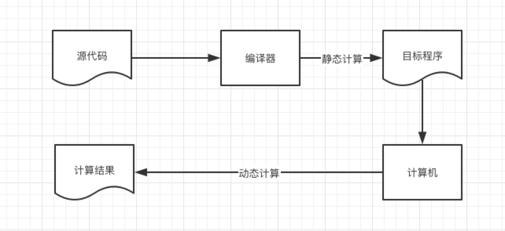
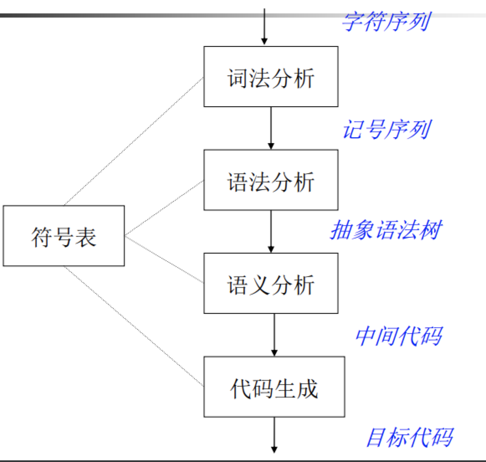
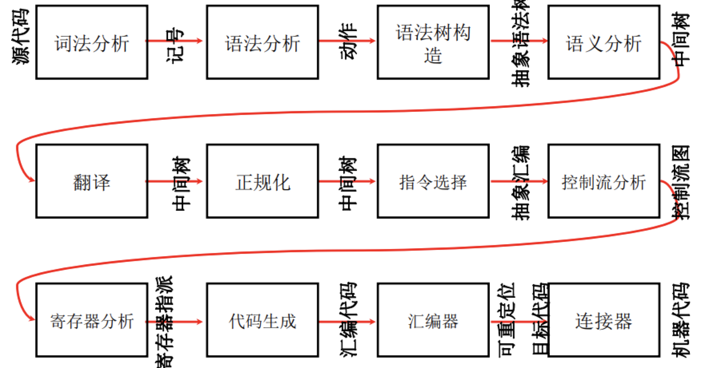
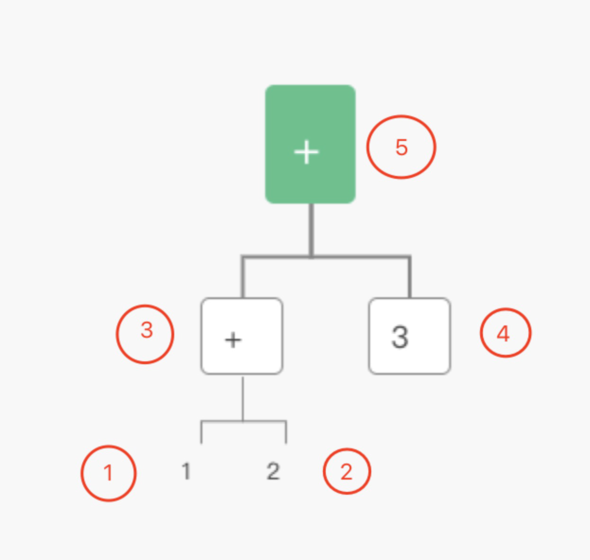

# 编译器

## 什么是编译器？
> 计算机设备包括个人计算机、大型机、嵌入式系统、智能设备等核心问题都是软件的构造
目前绝大多数的软件都是由高级语言书写的（成百上千种高级语言）
这些语言是如何运行在计算机系统上的呢？----------> **编译器**

**编译器**是一个**程序**: 核心功能是把`源代码`翻译成`目标代码`

* 源代码： C/C++、Java、C#、html、SQL...
* 目标代码：x86、IA64、ARM、MIPS...

## 编译器的核心功能

## 编译器和解释器
* 解释器也是处理程序的一种**程序** 

* 解释器是一种在线的方式（处理代码的过程中，同时将结果展示出来），但编译器是一种离线的方式（静态分析源代码，生成结果代码后等待执行）
* 两者有很多的共同点

## 为什么学习编译原理
* 编译原理集中体现了计算机科学的很多核心思想
    - 算法
    - 数据结构
    - 软件工程
* 编译器是其他领域重要研究基础
* 编译器本身就是一个非常重要的研究领域
    - 新的语言
    - 大型软件的构造和维护

## 编译器的结构
编译器 具有非常**模块化**的高层结构，可以看成多个阶段构成的"流水线"结构
* 未优化的结构

* 更复杂的结构

编译器由多个阶段组成，每个阶段都要处理不同的问题，使用不同的理论、数据结构和算法
因此，编译器设计中的重要问题是如何合理的划分组织各个阶段
    - 接口清晰
    - 编译器容易实现、维护

## 简单编译器的例子
* 源语言： 加法表达式 Sum，有以下两种语法形式
    - 整型数字： n
    - 加法： e1 + e2
* 目标机器： 栈式计算机 Stack
    - 一个操作数栈
    - 两条指令
        + 压栈指令：push n
        + 加法指令： add

* 任务：编译程序`1 + 2 + 3`到栈式计算机。编译器阶段如下：
    - 阶段一：词法语法分析
        + 词法分析 将`1+2+3`分为`1`、`+`、`2`、`+`、`3`五个部分
        + 语法分析 将上面五个部分分别进行分析：每个部分是否满足`Sum`语法的要求
    - 阶段二：语法树的构建
    
    - 阶段三：代码生成
        + 后续遍历post-order（[二叉树的遍历算法之一](https://www.jianshu.com/p/17548f7e5b1a)）
        
        
            1. 读入1 => 栈 push `1`
            2. 读入2 => 栈 push `2`
            3. 读入+ => add、栈 pop `2`、栈 pop `1`、 栈 push `1 + 2` 的结果 `3`
            4. 读入3 => 栈 push `3`
            5. 读入+ => add、栈 pop `3`、栈 pop `3`、 栈 push `3 + 3` 的结果 `6`
            
## 编译器的重要的一些性质
作为一个软件系统，编译器也有很多方面的性质：

    - 编译的效率，即编译一个程序的速度和代价；

    - 编译生成代码的效率，即编译器生成的可执行程序的运行效率；

    - 编译生成代码的质量，即和源代码语义等价性；
