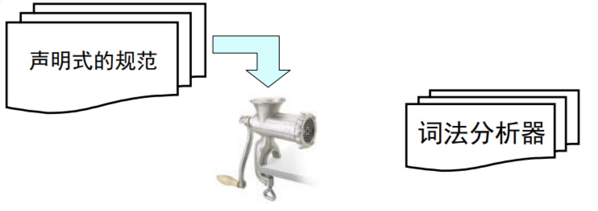
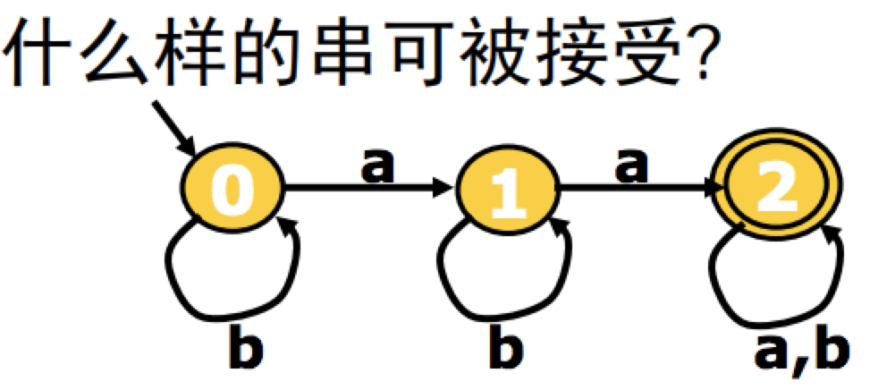
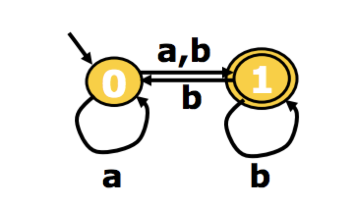
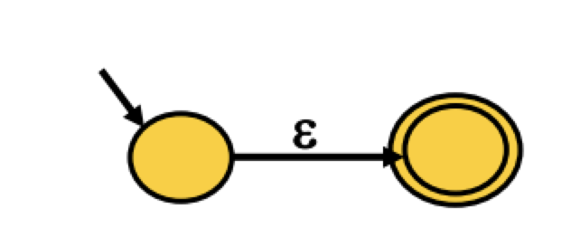
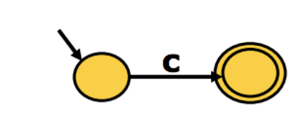
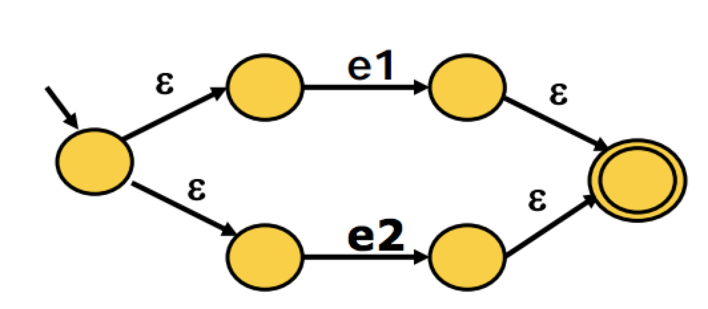
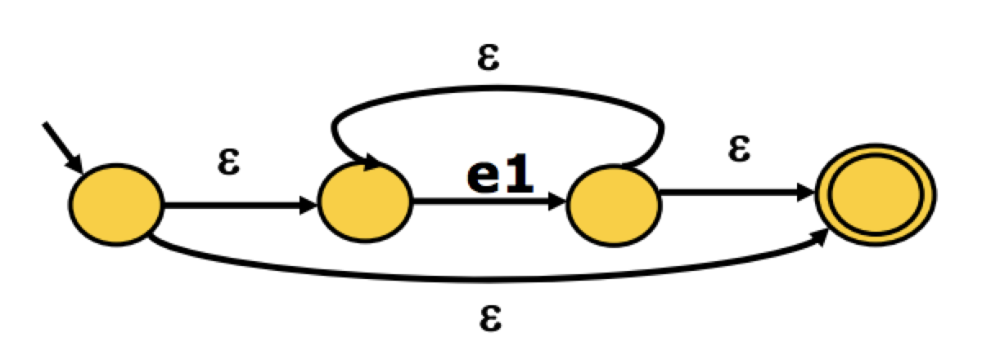
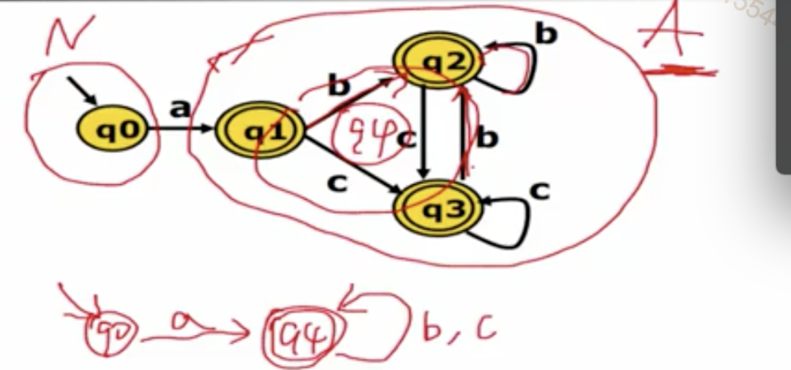

# 词法分析

## 编译器的阶段


### 前端front end（不是我们理解的写web页面js、css的前端，而是编译器的前端部分）


### 词法分析器的任务
将**字符流**转换为**记号流**
* 字符流 和被编译的语言密切相关 (ASCII, Unicode, or …) 
* 记号流 编译器内部定义的数据结构，编码所识别出的词法单元

* 例子：
    - 字符流
        ```
        if (x > 5)
            y = “hello”;
        else
            z = 1;
        ```
    - 记号流
        ```
        IF LPAREN IDENT(x) GT INT(5) RPAREN
            IDENT(y) ASSIGN STRING(“hello”) SEMICOLON
        ELSE
            IDENT(z) ASSIGN INT(1) SEMICOLON EOF
        ```
### 记号的数据结构定义
```javascript
const kind = {
    IF: 0,
    LPAREN: 1,
    ID: 2,
    INTLIT: 3,
    …
};
// 结构体
class Token{
    constructor(props) {
        this.kind = props.kind;
        this.lexeme = kind[props.kind]; // kind在enum中的下标
        ...
    }
};

```
* 字符集经过词法分析后变成：
```
[
    { kind: 'IF', lexeme: 0, ...},
    { kind: 'LPAREN', lexeme: 1, ...},
    ...
]
```

## 词法分析器的实现方式

至少两种实现方式
* 手工编码实现法
    - 相对复杂、容易出错
    - 但是目前很流行 如gcc、LLVM...
* 词法分析器的生成器： JLex、FLex、Lex
    - 可以快速原型、代码量比较少
    - 较难控制细节
    
## 词法分析器的生成器


[Thompson算法](https://baike.baidu.com/item/Thompson%E6%9E%84%E9%80%A0%E6%B3%95/22735759?fr=aladdin)
[子集构造算法](https://www.jianshu.com/p/6bfc32fb520a)
[Hopcroft最小化算法](https://www.jianshu.com/p/4900b44ada62)

需要用到的数学工具： **有限状态自动机(FA)**

### 有限状态自动机


* 确定状态有限自动机`DFA`例子

```javascript
const M = {
    Σ: ['a','b'],// 字母表
    S: [0, 1, 2], // 状态集
    q0: 0, // 初始状态
    F: [2], // 终结状态集   两个圆圈嵌套的状态表示终结状态
    δ: [
            (q0,a) => q1,
            (q0,b) => q0,
            (q1,a) => q2,
            (q1,b) => q1,
            (q2,a) => q1,
            (q2,b) => q2,
    ], // q0 q1 q2 代表0，1，2三个状态
};
```
* 非确定的有限状态自动机`NFA`例子

```javascript
const M = {
    Σ: ['a','b'],// 字母表
    S: [0, 1], // 状态集
    q0: 0, // 初始状态
    F: [1], // 终结状态集   两个圆圈嵌套的状态表示终结状态
    δ: [
            (q0,a) => [q0, q1],
            (q0,b) => q1,
            (q1,b) => [q0, q1],
    ], // q0 q1  代表0，1，三个状态
};
```

### DFA 和 NFA的区别
* 确定状态有限自动机DFA    对任意的字符，最多有一个状态可以转移
* 非确定的有限状态自动机NFA    对任意的字符，有多余一个状态可以转移

### DFA的实现

|状态\字符|a|b|
| ---- | ---- | ----- |
| q0 | q1 | q0 |
| q1 | q2 | q1 |
| q2 | q2 | q2 |

### `RE`到`NFA`： Thompson算法
* 基于对RE的结构做归纳
> ε边代表不需要输入任何字符

    - 对基本的RE直接构造
        + e -> ε
        
        + e -> C
        
    - 对复合的RE递归构造
        + e -> e1 e2
        
        + e -> e1 | e2
        
        + e -> e1*
        

* 复杂示例：a(b|c)*
        
        
### `NFA`到`DFA`：子集构造算法
针对上面的复杂案例进行转换

```
1. q0 --a--> [n1, n2, n3, n4, n6n n9]: q1
                   |
                   | 1. δ状态转换得到一个`ε`集合； 2. 对`ε`集合每个元素进行`ε`闭包看`ε`边界是什么
                   V
2. q1 --b--> [n5, n8, n9, n3, n4, n6]: q2
3. q2 --c--> [n7, n8, n9, n3, n4, n6]: q3
```


```
`ε`-闭包的计算：深度优先算法
/* ε-closure: 基于深度优先遍历的算法 */
// 创建一个闭包集合
set closure = {}; 
// ε闭包函数
void eps_closure (x)
    // 这个闭包集合将符合条件的状态加入到集合中
    closure += {x}
    // 遍历所有与x状态满足的有`ε`边的状态， 如果有且还没走过该边就继续递归执行ε闭包函数
    foreach (y: x--ε--> y)
        if (!visited(y))
            eps_closure (y)
            
            
/* ε-closure: 基于宽度优先的算法*/
set closure = {};
Q = []; // queue
void eps_closure (x) =
    Q = [x];
    while (Q not empty)
        q <- deQueue (Q)
        closure += q
        foreach (y: q--ε--> y)
        if (!visited(y))
            enQueue (Q, y)
```

```
(* 子集构造算法: 工作表算法 *)
// q0 = [n0]
q0 <- eps_closure (n0)
Q <- {q0}
workList <- q0
while (workList != [])
    remove q from workList
    foreach (character c)
        t <- e-closure (delta (q, c)) // t = [n1, n2, n3, n4, n6, n9]
        D[q, c] <- t                    // DNF状态[q0状态，输入字符a] 得到的ε集合t，10--a--> q1
        if (t\not\in Q)
            add t to Q and workList
```

* 该算法最坏情况O(2^N) 实际不常发生，因为并不是每个子集都会出现

## DFA最小化
*Hopcroft算法
```
// 基于等价类的思想
split(S)
    foreach (character c)
        if (c can split S)
            split S into T1, …, Tk
hopcroft ()
    split all nodes into N, A // N：非等价类，非接收状态， 一个圈； A 等价类，接收状态，两个圈
    while (set is still changes)
        split(S)
```


* 示例2 

    - 步骤分析
    ```
    1. 整个状态机分两类 N: [q0, q1, q2, q3]; A: [q3, q5], q3、q5通过一个e字符都能到达，且状态相同，所以属于等价类
    2. q2、q4都能接收e字符，可以分为一类 [q2, q4]
    3. q0不能接收e,q1能接收e，所以分为两类 [q0], [q1]
    综合上诉总共有四个分类 ，分别是 [q0], [q1], [q2, q4]. [q3, q5]
    
    ```
    - 最小化后的状态图
    

## 从DFA生成代码

### DFA的代码表示
> 针对 a(b|c)*说明
|状态\字符|a|b|c|
| ---- | ---- | ---- | ---- |
| 0 | 1 | | |
| 1 | | 1| 1|

* 转移表 (类似于邻接矩阵)

```
nextToken()
    state = 0
    stack = []
    while (state!=ERROR)
        c = getChar()
        if (state is ACCEPT)
            clear(stack)
        push(state)
        state = table[state][c]
    while(state is not ACCEPT)
        state = pop();
        rollback();
```
- 最长匹配 下图做个说明：
    
    ```
    nextToken()
        state = 0
        stack = []
        while (state!=ERROR)
            c = getChar()
            if (state is ACCEPT)
                clear(stack)
            push(state)
            state = table[state][c]
        while(state is not ACCEPT)
            state = pop();
            rollback();
    ```
*  哈希表
*  跳转表
```
nextToken()
    state = 0
    stack = []
    goto q0

q0:
    c = getChar()
    if (state is ACCEPT)
        clear (stack)
    push (state)
    if (c==‘a’)
        goto q1
q1:
    c = getChar()
    if (state is ACCEPT)
       clear (stack)
    push (state)
    if (c==‘b’||c==‘c’)
       goto q1 
```
*  。。。
